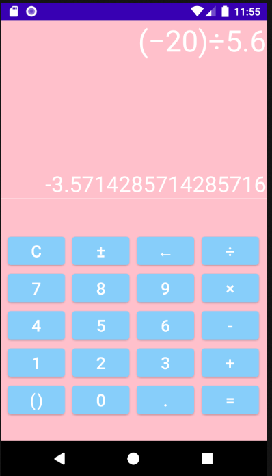

# Calculator (1.0.0)

- 나의 첫 안드로이드 앱 `'Calculator'`은 사칙연산이 가능한 간단한 계산기 앱 이다.
- 계산 원리는 갤럭시에 기본 계산기앱을 참고했다.

# 화면

# 계산 원리

`TextView`에 입력된 `중위표기식`을 `후위표기식`으로 바꾼 다음에 계산을 했다. 이유는 후위표기식이 `컴퓨터입장`에서 계산할 때 다른 표기식에 비해 좋은 성능이 나오기 때문이다.

# 앞으로의 계획

앞으로 `공학용계산 기능`을 넣을 생각이다.
